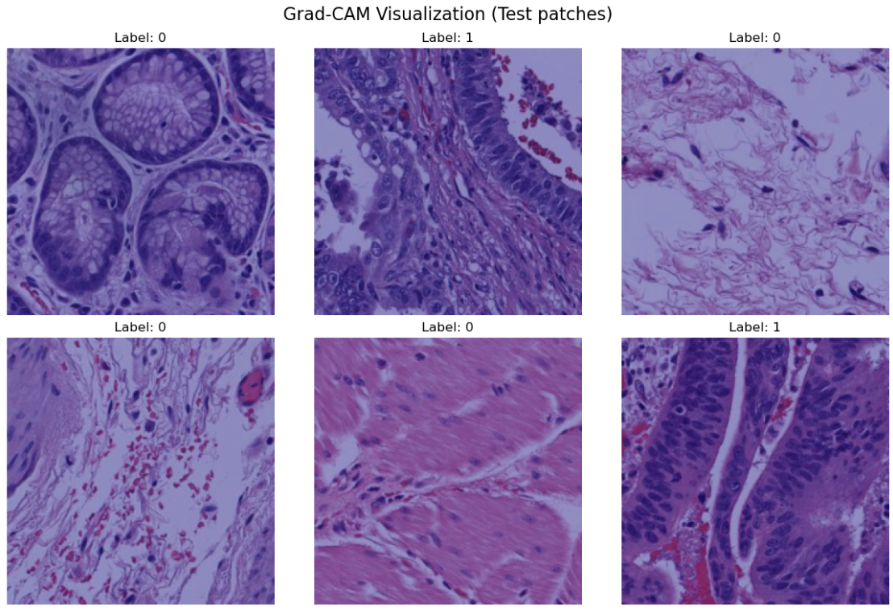

В этом проекте я автоматизирую распознавание рака пищевода на гистопатологических изображениях (H&E) с использованием методов компьютерного зрения и глубокого обучения.

В проекте использовался на открытый датасет TCGA (The Cancer Genome Atlas), и мной был реализован полный пайплайн: от загрузки данных и обучения модели до интерпретации результатов с помощью Grad-CAM.

---

## Цель проекта

Основная цель - разобраться в практическом применении deep learning для медицинского computer vision.

---

## Что реализовано в проекте
- Подготовка и загрузка датасета с гистологическими изображениями (H&E)
- Обучение CNN-модели для классификации изображений
- Оценка качества модели на тестовой выборке
- Визуализация результатов классификации
- Реализация **Grad-CAM** для интерпретации предсказаний модели  
  (поиск областей, на которые сеть обращает внимание)

---

## Интерпретация модели (Grad-CAM)

Для интерпретации работы нейросети используется **Grad-CAM**, который позволяет визуально увидеть, какие области изображения наиболее важны для принятия решения классификатором.

Это особенно важно для медицинских задач, где требуется  высокая точность и объяснимость модели.

### Пример визуализации Grad-CAM
> Ниже приведён пример тепловой карты внимания модели, наложенной на исходное гистопатологическое изображение.

<p align="center">
  
</p>

---

## Используемые технологии
- Python  
- PyTorch  
- torchvision  
- NumPy  
- Matplotlib  
- OpenCV  

---

## Структура проекта
```text
notebooks/  — ноутбуки для обучения, тестирования и визуализации  
models/     — сохранённые веса моделей  
utils/      — вспомогательные функции  
data/       — структура для размещения данных (сами данные в репозиторий не загружаются)  
assets/     — изображения для README (Grad-CAM визуализации)
src/        — python скрипты
```
---
Для интерпретации модели используется Grad-CAM, который позволяет визуально увидеть, какие области изображения наиболее важны для принятия решения классификатором. Это  важно для медицинских задач, где требуется объяснимость модели.
